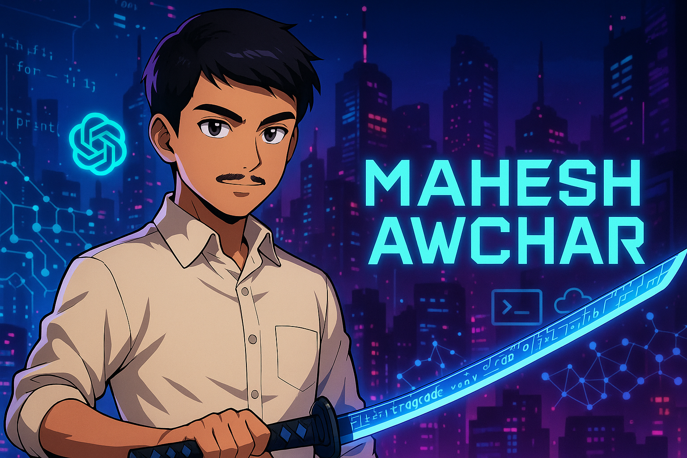

# Welcome to My GitHub Profile!

Hi there! I'm **Mahesh Awchar**, a passionate developer, AI enthusiast, data science student, and cybersecurity practitioner.  
I love building scalable AI applications, exploring LLM architectures, and optimizing machine learning models.

---

## 🚀 Tech Stack

### 🧠 Programming & Core Concepts

  
  
  
  

### ☁️ Data Science & DevOps

  
  
  
  
  

### 🧠 AI & Machine Learning

  
  
  
  

### 🧬 Large Language Models (LLMs)

  
  
  

## 🐍 Python Projects
- [Data Analyzer](https://github.com/mahesh-awchar/python-data-analyzer): A tool for analyzing datasets using pandas and matplotlib.
- [Web Scraper](https://github.com/mahesh-awchar/python-web-scraper): Automates data extraction from websites.

## 🌐 HTML, CSS, and JavaScript Projects
- [Portfolio Website](https://github.com/mahesh-awchar/html-css-portfolio-website): Personal portfolio showcasing projects and skills.
- [ToDo App](https://github.com/mahesh-awchar/javascript-todo-app): A simple task management application.

## 🔐 Cybersecurity Projects
- [Network Scanner](https://github.com/mahesh-awchar/cybersecurity-network-scanner): Scans and identifies devices on a network.
- [Password Cracker](https://github.com/mahesh-awchar/cybersecurity-password-cracker): Demonstrates password cracking techniques for educational purposes.

## 🤖 AI Projects
- [Chatbot](https://github.com/mahesh-awchar/ai-chatbot): An AI-powered chatbot using NLP techniques.
- [Image Classifier](https://github.com/mahesh-awchar/ai-image-classifier): Classifies images using convolutional neural networks.
